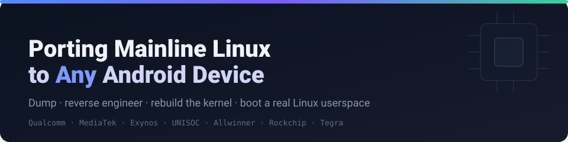
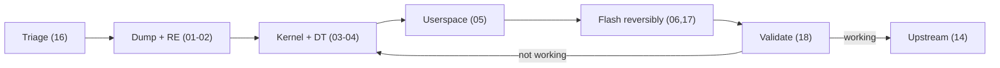

### Operating-systems engineering notes &amp; guides

A vendor-agnostic, end-to-end method for turning an Android device whose
vendor abandoned it into one running a real, maintained Linux userspace.

**[Start the guide →](docs/android-linux-porting/00-overview.md)**

---

## The guide

### [Porting Mainline Linux to Any Unsupported Android Device](docs/android-linux-porting/00-overview.md)

Dump the firmware, reverse engineer the closed drivers / HALs / bootloader
with Ghidra, rebuild a buildable kernel and device tree, and assemble a
Linux rootfs — reusing vendor blobs through a Halium/libhybris shim only
for the subsystems that genuinely need it. Covers **Qualcomm, MediaTek,
Samsung Exynos, UNISOC, HiSilicon,** and tablet-class **Allwinner,
Rockchip, Tegra**.

> **New here?** Read **[Feasibility Triage (16)](docs/android-linux-porting/16-feasibility-triage.md)**
> first — a handful of device facts decide whether a port takes a weekend
> or is impossible, and you can check them before touching the hardware.

## Chapter map

| | Phase | Chapters |
|---|---|---|
| **Plan** | Decide if it's worth it | [16 Triage](docs/android-linux-porting/16-feasibility-triage.md) |
| **Acquire** | Get the bits off the device | [01 Dumping](docs/android-linux-porting/01-firmware-dumping.md) &#183; [02 Ghidra RE](docs/android-linux-porting/02-reverse-engineering-ghidra.md) |
| **Understand** | Map the hardware | [03 Hardware ID](docs/android-linux-porting/03-hardware-identification.md) &#183; [09 Per-vendor specifics](docs/android-linux-porting/09-soc-vendor-specifics.md) |
| **Build** | Kernel &amp; userspace | [04 Kernel](docs/android-linux-porting/04-kernel-porting.md) &#183; [05 Rootfs / userspace](docs/android-linux-porting/05-rootfs-and-userspace.md) |
| **Boot** | Flash &amp; recover safely | [06 Bootloader / flashing](docs/android-linux-porting/06-bootloader-and-flashing.md) &#183; [17 Reversible dev](docs/android-linux-porting/17-reversible-development.md) &#183; [12 OEM restore](docs/android-linux-porting/12-oem-restore.md) |
| **Finish** | Prove it, give it back | [18 Validation](docs/android-linux-porting/18-validation-and-testing.md) &#183; [19 Hard subsystems](docs/android-linux-porting/19-hard-subsystems.md) &#183; [14 Upstreaming](docs/android-linux-porting/14-upstreaming.md) |
| **Reference** | Look it up | [07 Tools](docs/android-linux-porting/07-tools-reference.md) &#183; [08 Case studies](docs/android-linux-porting/08-case-studies.md) &#183; [10 Device template](docs/android-linux-porting/10-device-profile-template.md) &#183; [11 Troubleshooting](docs/android-linux-porting/11-troubleshooting-and-debugging.md) &#183; [13 Glossary](docs/android-linux-porting/13-glossary.md) &#183; [15 Hardware lab](docs/android-linux-porting/15-hardware-lab.md) |

## Devices tracked

| Device | SoC | Status |
|---|---|---|
| [Anbernic RG405M](docs/android-linux-porting/devices/anbernic-rg405m/profile.md) | UNISOC T618 | Hardware-proven native Yocto port (RGOS) — see the [case study](docs/android-linux-porting/08-case-studies.md) |
| [Blackview BL6000 Pro 5G](docs/android-linux-porting/devices/blackview-bl6000-pro-5g/profile.md) | MediaTek Dimensity 800 | Profile from research; awaiting a cataloged dump |

<b>Tooling &amp; conventions</b>

 

- **`scripts/`** — scaffold a device profile, unpack a boot image, recover
  the kernel config, extract vendor partitions, back up and restore stock
  firmware, and a [`check-docs.sh`](docs/android-linux-porting/scripts/check-docs.sh)
  consistency checker run in CI.
- **`templates/`** — the source templates `new-device.sh` renders from.
- **`devices/`** — per-device profiles tracking a specific port end-to-end.
- **[`HANDOFF.md`](docs/android-linux-porting/HANDOFF.md)** — the checklist
  for whoever has physical device access.
- **[`CONTRIBUTING.md`](docs/android-linux-porting/CONTRIBUTING.md)** —
  conventions: notes not binaries, verify before stating, run the checker.

---

Written in the spirit of open-source etiquette: **document the method,
credit the prior work it builds on, share what's learned** — notes and
derived data, never vendor binaries — so the next device and the next
person have somewhere to start.

See the overview's <i>Why do this</i>, <i>A note on ownership and credit</i>, and <i>Why this is shared openly</i>.

