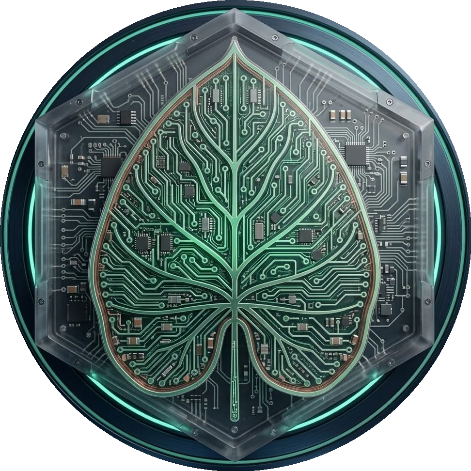

# SMBrix

> A hardware-first custom OS built specifically for the HP Chromebook 14-SMB.

## Boot Logo



Circuit board leaf inside a glowing teal ring.

### Usage

| Context | Behavior |
|---------|----------|
| **Startup** | Displayed via Plymouth splash screen on every boot, before login prompt |
| **Default app icon** | Any application or script without its own logo falls back to `boot_logo.png` |

The boot logo is the system-wide identity — it appears at startup and acts as the fallback for anything unbranded. No application ships without a logo in SMBrix.

---

## Concept

SMBrix is purpose-built for one machine. Every decision — kernel config, drivers, storage layout, interface — is made with the Chromebook 14-SMB's exact hardware in mind. It runs on a fully unlocked UEFI layer via MrChromebox, with Debian minimal as its base.

The name comes directly from the machine: **14-SMB** (Small & Medium Business model).

---

## Target Hardware

| Component | Spec |
|-----------|------|
| Device | HP Chromebook 14-SMB |
| CPU | Intel Celeron 2955U (Haswell, 2c/2t @ 1.4GHz) |
| GPU | Intel HD Graphics — `i915` driver |
| RAM | 4GB DDR3L |
| Storage | 16GB eMMC |
| Display | 14" 1366x768 |
| WiFi | Intel Dual Band Wireless-AC 7260 (`iwlwifi`) |
| Bluetooth | 4.0 |
| Firmware | MrChromebox UEFI |

---

## Base OS

**Debian minimal** — chosen because:
- Smallest possible footprint for a 16GB eMMC
- Kali (currently on the machine) already validates Debian hardware compatibility
- Full control over every installed package
- `firmware-iwlwifi` and `intel-microcode` available in non-free repos — one-step fix

---

## Storage Budget

| Partition | Size |
|-----------|------|
| EFI | 512MB |
| Swap | 2GB |
| Root `/` | 10GB |
| Home `/home` | 3.5GB |

16GB total. Tight — no bloat allowed.

---

## Terminal Setup

**tmux** is the multi-terminal solution — not Terminator (which requires a GUI).

tmux gives you:
- Split panes horizontally and vertically within a single terminal
- Multiple named windows (like tabs)
- Session persistence — detach and reattach without losing your session
- Works over SSH, works headless, zero display dependency

### Shell — zsh

Matches Kali's default (switched from bash in 2020). Familiar from the existing setup on the device.

Plugins:
- `oh-my-zsh` — plugin/theme framework
- `zsh-autosuggestions` — fish-style inline suggestions
- `zsh-syntax-highlighting` — colors commands as you type

### Emoji Support 🎨

Emoji work natively in zsh scripts, the prompt, and the tmux status bar.

Requirements:
- Locale set to `en_US.UTF-8`
- **JetBrainsMono Nerd Font** — covers full emoji + powerline icons
- tmux: `set -g utf8 on`

Use emoji directly in scripts:
```zsh
echo "🔒 VPN connected"
echo "📡 WiFi: $(iwconfig 2>/dev/null | grep ESSID)"
echo "🔋 Battery: $(cat /sys/class/power_supply/BAT0/capacity)%"
```

### Color Schemes

Six schemes included — switch between them per session or set a default:

| Scheme | Style | Best For |
|--------|-------|----------|
| **Dracula** ⭐ default | Dark purple/pink, high contrast | Low-light use |
| **Nord** | Cool blue-grey, muted | Long sessions, easy on eyes |
| **Gruvbox Dark** | Warm amber/green retro | High readability |
| **Catppuccin Mocha** | Soft pastel dark | Modern aesthetic |
| **Tokyo Night** | Deep blue/purple, vibrant | Visual pop |
| **Solarized Dark** | Classic, precision contrast | Scientifically tuned |

Schemes applied across: **tmux** · **vim** · **zsh prompt**

---

## Kernel Configuration

Custom kernel config targeting this hardware specifically:

| Config | Purpose |
|--------|---------|
| `CONFIG_MHASWELL` | Haswell CPU optimizations |
| `CONFIG_MMC`, `CONFIG_MMC_SDHCI` | eMMC storage support |
| `CONFIG_DRM_I915` | Intel integrated GPU |
| `CONFIG_IWLWIFI` | Intel 7260 WiFi |
| `CONFIG_WIREGUARD` | Built-in WireGuard support |
| Disable floppy, parallel port, SCSI tape, etc. | Remove unused driver overhead |
| cgroups + namespaces | Container support |

---

## Core Packages

**Networking**
`NetworkManager` · `iwd` · `nmap` · `curl` · `wget`

**Terminal**
`tmux` · `vim` · `htop` · `tree` · `bat` · `fzf`

**System**
`sudo` · `ufw` · `logrotate` · `cron` · `rsync`

**VPN**
`tailscale` · `wireguard-tools` · `openvpn`

**Hardware**
`firmware-iwlwifi` · `intel-microcode` · `thermald`

---

## VPN — CLI Only

No GUI required for VPN:

| Method | Command | Notes |
|--------|---------|-------|
| **Tailscale** | `tailscale up` / `tailscale down` | Preferred — mesh VPN, zero-config, WireGuard under the hood |
| WireGuard | `wg-quick up wg0` | Manual tunnel config |
| OpenVPN | `openvpn --config file.ovpn` | Traditional VPN, wide server support |
| NetworkManager | `nmcli vpn connect <name>` | Any configured VPN connection |

**Tailscale** runs as a background daemon (`tailscaled`) and handles routing automatically. Best option for remote access to the Chromebook — `tailscale ssh` lets you reach the machine from anywhere without port forwarding.

---

## GUI

**Undecided.** Decision deferred until the base Debian install + kernel footprint is measured against the 16GB eMMC budget.

Candidates if included:
- **None** — pure CLI, maximum headroom
- **Openbox + tint2** — bare window manager, ~150MB
- **LXQt** — lightest full desktop, ~300MB

The `i915` driver is included regardless, so GUI can be added later without a kernel rebuild.

---

## Status

`Planning` — Base OS locked (Debian minimal). Kernel config and package list drafted.

## Next Steps

- [ ] Choose shell (bash / zsh / fish)
- [ ] Finalize kernel config
- [ ] Measure base install footprint vs. 16GB budget
- [ ] Decide GUI inclusion
- [ ] Document boot sequence (UEFI → GRUB → SMBrix)
- [ ] Draft tmux default config
